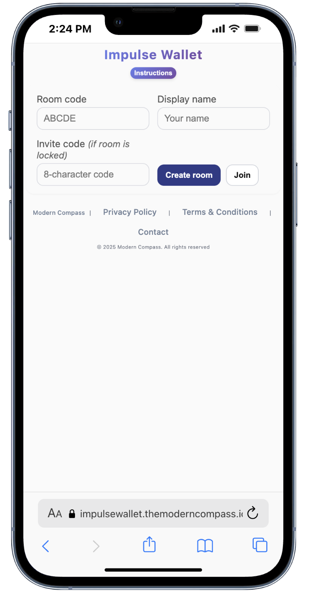
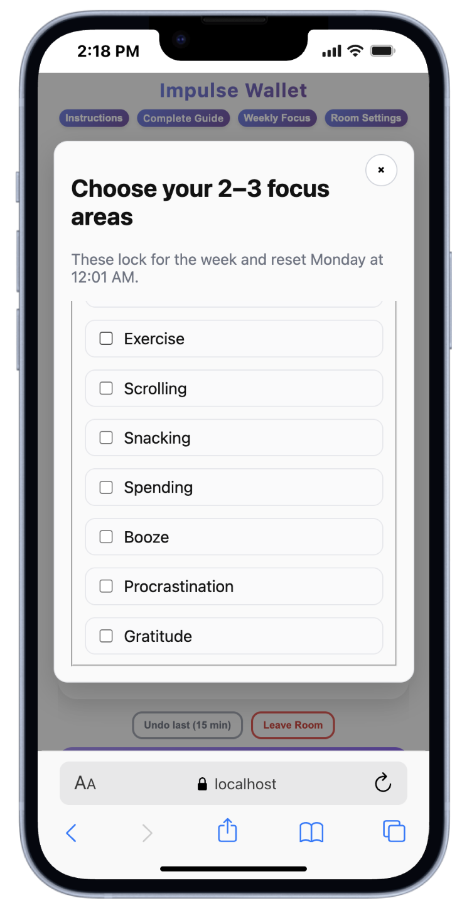
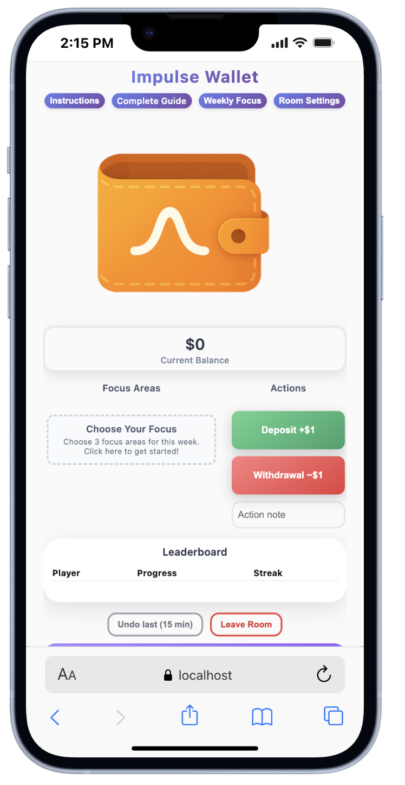
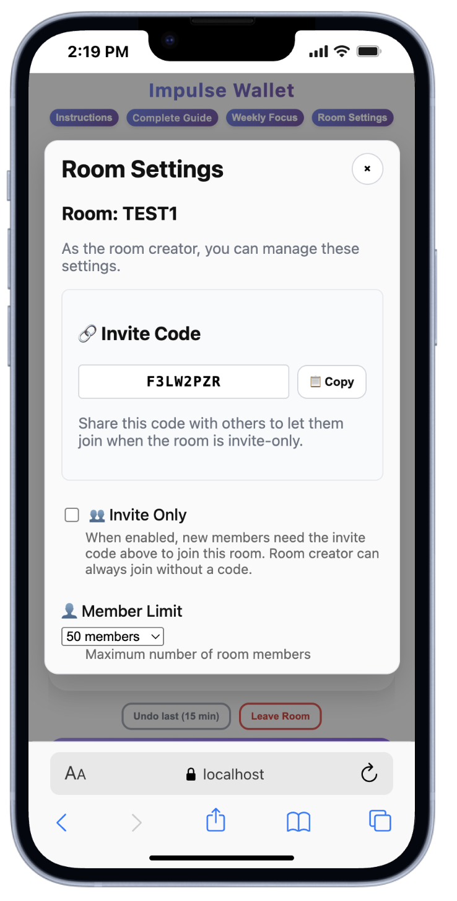
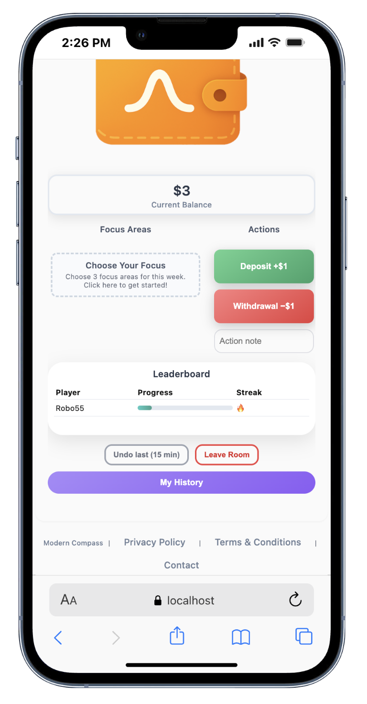
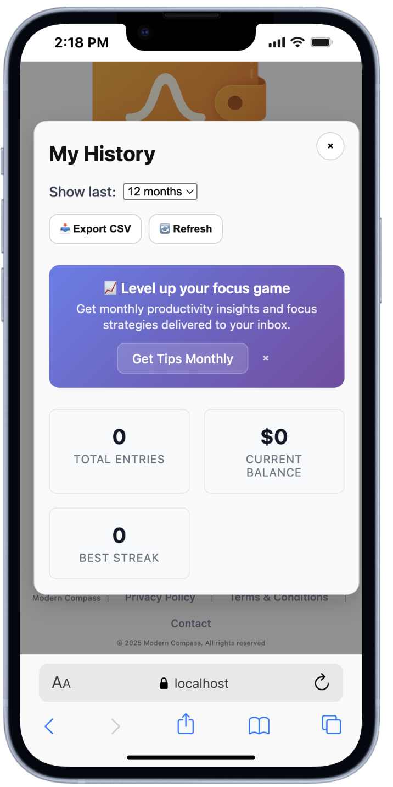

# Impulse Wallet - Complete Onboarding Guide

*Transform your self-control into a game you actually want to play*

---

## Quick Start (2 minutes)

### 🚀 **First Visit? Start Here!**

1. **Join or Create Room** - The first screen you'll see! Either create your own room with a custom name (like "FAMILY" or "WORK") or join someone's existing room using their invite code (all rooms are private by default for your security)
2. **No Signup Required** - Just open the app and you're ready to go with your anonymous account
3. **Choose Focus Areas** - Click "Weekly Focus" to pick 2-3 areas for this week (these are private to you - others can't see your specific areas)
4. **Start Tracking** - Use +$1 for good choices, -$1 for slips - actions can be inside OR outside your focus areas
   ⚠️ **IMPORTANT:** These are virtual points, not real money

**Ready to dive deeper?** Continue reading for the complete experience.

### 🔑 Quick Start: Two Ways to Begin

**Option 1: Create Your Own Room**
- Enter a memorable name in "🏠 Room Name (yours)" field (like "FAMILY", "WORK", "GYM")
- Add your display name
- Click "Create room"
- Share your generated invite code with trusted people

**Option 2: Join Someone's Room**
- Leave the room name field empty
- Enter their invite code in "🔑 Invite Code (theirs)" field
- Add your display name
- Click "Join"

**Security Note:** All rooms are private by default - only people with invite codes can join.

---

## Table of Contents

1. [Understanding Impulse Wallet](#understanding-impulse-wallet)
2. [Getting Started Solo](#getting-started-solo)
3. [The Virtual Wallet System](#the-virtual-wallet-system)
4. [Weekly Focus Areas](#weekly-focus-areas)
5. [Creating & Managing Rooms](#creating--managing-rooms)
6. [Joining Existing Rooms](#joining-existing-rooms)
7. [Daily Usage & Best Practices](#daily-usage--best-practices)
8. [Advanced Features](#advanced-features)
9. [Troubleshooting](#troubleshooting)
10. [Tips for Success](#tips-for-success)

---

## Understanding Impulse Wallet

### What Is Impulse Wallet?

Impulse Wallet is your personal accountability partner that transforms self-control into a simple, gamified experience. Instead of complex habit tracking that overwhelms you, we use a straightforward virtual wallet system where:

- **Good choices = +$1 deposits**
- **Giving in to impulses = -$1 withdrawals**
- **Weekly focus areas keep you directed**
- **Accountability rooms provide gentle peer support**

### Core Philosophy

We believe that:
- **Simplicity beats complexity** - One dollar up or down is instantly clear
- **Fresh starts matter** - Your wallet resets every Monday
- **Accountability works** - You're 65% more likely to succeed with gentle peer support
- **Progress over perfection** - It's about building momentum, not being flawless
- **Privacy is essential** - No email required, anonymous usernames, all rooms private by default for your security and peace of mind

---

## Getting Started Solo

### First Visit Walkthrough

**Step 1: Room Creation/Joining Interface**
When you first visit, you'll see the main interface with two key fields:
- **🏠 Room Name (yours)**: Choose a memorable name for your room like "FAMILY", "WORK", or "GYM" (or leave empty for auto-generated)
- **🔑 Invite Code (theirs)**: Enter the invite code someone shared with you to join their existing room

You can either create your own private room OR join someone else's room - the interface handles both seamlessly.

*The initial create/join room interface - your entry point to Impulse Wallet*

**Step 2: Anonymous Account Creation**
Behind the scenes, we automatically create an anonymous account for you using:
- A secure UUID stored in your browser
- No email required - you can use any display name you prefer (real name or pseudonym)
- All your data stays with this anonymous ID

**Step 3: Your Empty Wallet**
Once you set up or join a room, you'll see the main wallet interface with:
- **$0 balance** - Fresh start!
- **No focus areas** - You can set these up by clicking "Weekly Focus"
- **Action buttons** - Ready for deposits (+$1) and withdrawals (-$1)
- **Instructions button** - Quick access to system overview

### Setting Up Focus Areas

**Why Focus Areas Matter:**
Focus areas give your daily actions meaning and direction, but remember - they're completely private to you. Other room members can't see your specific focus areas, only your overall progress.

**Important: Actions Can Go Beyond Focus Areas**
Your deposits and withdrawals don't have to connect to your focus areas! If something positive happens in any area of life, give yourself credit. Examples:
- Choosing Michelob Ultra over a sugary margarita
- NA beer instead of regular beer
- Any conscious positive choice, even if it's not in your tracked areas

**How to Set Them:**
1. Click the "Weekly Focus" button in the header
2. Choose 2-3 areas from our preset options:
   - **Positive areas**: Eat Healthy, Exercise, Gratitude
   - **Resistance areas**: Scrolling, Snacking, Spending, Booze, Procrastination
3. Add custom areas if needed
4. Click "Save"

*The weekly focus picker modal - choose 2-3 areas that matter to you this week*

**Important Notes:**
- Focus areas lock for the week and reset every Monday at 12:01 AM
- You can have up to 3 areas active at once
- Choose areas that feel achievable but meaningful

### Making Your First Transactions

**Deposit (+$1):**
1. Click the green "Deposit +$1" button
2. Add a brief note (optional but recommended)
3. Examples:
   - "Chose water over soda"
   - "10-minute walk"
   - "Resisted checking phone"

**Withdrawal (-$1):**
1. Click the red "Withdrawal -$1" button
2. Add a note about what happened
3. Examples:
   - "Scrolled for 30 minutes"
   - "Ordered takeout instead of cooking"
   - "Skipped morning routine"

**The 15-Minute Grace Period:**
Made a mistake? Click "Undo last (15 min)" to reverse your most recent transaction within 15 minutes.

*The main wallet interface showing your balance, action buttons, focus areas, and room leaderboard*

---

## The Virtual Wallet System

### How the Dollar System Works

**Simple Decision Framework:**
Every choice becomes a simple question: "Is this a +$1 or -$1 moment?"

**The "Intentional Effort" Concept:**
Every $1 should represent conscious effort, not routine habits. If something has become automatic and requires no effort (like intermittent fasting you've done for months), it doesn't earn a deposit. Focus on choices that require intentional decision-making.

**Logging Beyond Focus Areas:**
Your deposits can come from ANY positive choice in life, not just your selected focus areas. Examples:
- Choosing a healthier drink option at dinner
- Taking the stairs instead of elevator
- Being kind to a difficult person
- Any moment where you choose the better option

**Deposit Examples (+$1):**
- ✅ Choosing a healthy snack
- ✅ Doing a planned workout
- ✅ Finishing a work task instead of procrastinating
- ✅ Practicing gratitude
- ✅ Resisting an impulse buy
- ✅ Limiting social media time

**Withdrawal Examples (-$1):**
- ❌ Eating junk food when you planned to eat healthy
- ❌ Skipping exercise
- ❌ Procrastinating on important tasks
- ❌ Mindless scrolling
- ❌ Impulse purchases
- ❌ Breaking commitments to yourself

### Balance & Streaks

**Your Balance:**
- Starts at $0 each Monday
- Can go positive or negative
- Represents your overall momentum for the week

**Streak Tracking:**
- **Positive streaks**: Consecutive deposits without withdrawals
- **Recovery**: Withdrawals reset your streak but don't erase progress
- **Focus**: Streaks measure consistency, not perfection

### Weekly Reset System

**Every Monday at 12:01 AM:**
- Your balance returns to $0
- Streaks reset
- You can choose new focus areas
- Fresh start with lessons learned

**Why Weekly Resets Work:**
- Prevents long-term shame spirals
- Allows for life's natural ups and downs
- Keeps the system feeling fresh and achievable
- Aligns with natural weekly rhythms

---

## Weekly Focus Areas

### Choosing Effective Focus Areas

**The 2-3 Rule:**
Choose 2-3 areas maximum. More areas lead to decision fatigue and tracking overwhelm.

**Positive vs. Resistance Areas:**
- **Positive**: Things you want to do more (Exercise, Gratitude)
- **Resistance**: Things you want to do less (Scrolling, Snacking)
- **Mix**: Choose a combination that feels balanced

**Area Categories:**

**Health & Wellness:**
- Eat Healthy
- Exercise
- Sleep routine
- Hydration
- Meditation/mindfulness

**Productivity:**
- Work focus
- Procrastination resistance
- Learning/reading
- Organization
- Digital boundaries

**Social & Emotional:**
- Gratitude practice
- Relationship building
- Communication
- Self-care
- Stress management

**Financial:**
- Spending control
- Saving habits
- Budget adherence
- Impulse purchase resistance

### Custom Focus Areas

**Adding Custom Areas:**
1. In the Weekly Focus modal, use the "Add a custom area" field
2. Keep it specific and actionable
3. Frame it positively when possible

**Good Custom Examples:**
- "Morning pages writing"
- "Call family weekly"
- "Meal prep Sunday"
- "10 minutes tidying"

**Avoid These:**
- Too vague: "Be better"
- Too many areas at once
- Overly complex requirements

### Weekly Balance Strategy: The $20 Pattern

**Understanding Your Balance Patterns:**
Your weekly balance tells a story about your goals and self-expectations.

**If you're hitting +$20 every week:**
- Your goals might be too easy
- You're not pushing yourself forward enough
- Consider adding more challenging focus areas
- Look for areas where you can stretch yourself

**If you're hitting -$20 every week:**
- Re-evaluate your focus areas - you might be too hard on yourself
- Consider if your areas are realistic for your current life situation
- Add "quick hit" positive focus areas to balance challenging ones
- Remember: progress over perfection

**The Sweet Spot:**
Aim for a balance that fluctuates week to week, sometimes positive, sometimes negative, but always teaching you something about your patterns and growth edges.

### Focus Area Strategy: Quick Hits vs. Challenges

**Balancing Your Focus Areas:**
When struggling with challenging areas (like "eating healthy" where you might hit -$1 frequently), add "quick hit" positive areas to maintain momentum.

**Quick Hit Examples:**
- "Tell myself something I like about myself" (2-minute task, multiple times daily)
- "Practice gratitude" (can be done anywhere, anytime)
- "Take three deep breaths" (instant positive action)
- "Send a kind text to someone" (quick, meaningful action)
- "Drink a full glass of water" (simple health win)

**Why Quick Hits Work:**
- They provide easy +$1 opportunities to balance out challenging areas
- Build positive momentum when facing difficult behavior changes
- Create successful patterns that support bigger goals
- Prevent discouragement from repeatedly hitting -$1 on harder areas

**Strategic Combinations:**
- Week with "Stop Scrolling" (-$1 heavy)? Add "Gratitude practice" (+$1 easy)
- Week with "Exercise daily" (challenging)? Add "Morning affirmation" (achievable)
- Week with "No impulse buying" (hard)? Add "Compliment someone" (simple)

---

## Creating & Managing Rooms

### Why Use Accountability Rooms?

**The Power of Gentle Accountability:**
- **65% higher success rate** when someone knows your goals
- **Motivation through visibility** without judgment
- **Shared momentum** when you see others succeeding
- **Support system** for tough moments
- **Private, trusted spaces** where you feel safe to be vulnerable about your growth

### Creating Your First Room

**Step 1: Create Your Private Room**
1. In the main interface, enter a memorable room name in the "🏠 Room Name (yours)" field (like "FAMILY", "WORK", "GYM") or leave empty for auto-generated
2. Enter your display name (this is what others will see)
3. Click "Create room"
4. The system automatically generates a secure 8-character invite code for your room
5. Your room is **automatically private by default** - only people with your invite code can join

**Why Privacy Matters:**
Your accountability space should feel safe and trusted. By making rooms private by default, we ensure only people you specifically invite can see your progress and participate in your journey.

**Step 2: Share Your Secure Room**
As the room creator, you can access "Room Settings" to manage your private room and share access with trusted people:

*The room creation and settings interface - private by default with "Make Public" option and member limits*

**Privacy Options:**
- **Private Room** (Default): Requires both room code and invite code for secure access
- **Make Public**: You can choose to make your room public, allowing anyone with just the room code to join

**Member Management:**
- **Member Limit**: Choose from 10, 25, 50, or 100 members
- **Member List**: See who's in your room
- **Remove Members**: If needed (as room creator)

**Step 3: Share Access Securely**
- **Room Name**: Your memorable room name (e.g., "FAMILY") that others will use to identify your room
- **Invite Code**: Your unique 8-character security code that grants access to your private room
- **Copy Function**: Use the copy button in Room Settings to share your invite code securely
- **Stay Private**: Keep your room private for maximum security and trust (recommended)
- **Optional**: You can choose "Make Public" later if you want open access, but private is safer

### Room Creator Responsibilities

**As the room creator, you can:**
- Manage your private room settings (member limits, "Make Public" option)
- View and manage the member list
- Share your unique invite code with trusted people
- Remove disruptive members (if necessary)
- Enjoy peace of mind knowing your room is private by default

**Understanding the Two Roles:**
- **Creating a room**: Use the "🏠 Room Name (yours)" field to make your own space
- **Joining a room**: Use the "🔑 Invite Code (theirs)" field to enter someone else's space

**Best Practices for Room Creators:**
- Your room starts private by default - share your invite code only with trusted people
- Set clear expectations for the group
- Only choose "Make Public" if you want open access (private is recommended)
- Be an active, positive participant
- Foster a supportive, non-judgmental environment
- Clearly explain to joiners: "Use my invite code in the invite code field, leave the room name field empty"

### Room Privacy & Security

**Privacy by Default:**
All new rooms are automatically private, requiring both codes for access. This protects your privacy and ensures only trusted people can join your accountability space.

**Room Code System:**
- **5-letter room codes** (e.g., "ABCDE")
- Generated randomly and checked for uniqueness
- Case-insensitive for easy sharing
- Required for all room access

**Invite Code System:**
- **8-character alphanumeric codes** automatically generated for every room
- Essential security layer that makes rooms private by default
- Provides secure sharing with trusted individuals
- Can be regenerated if compromised

**Data Privacy:**
- Only display names are visible to room members
- No personal information shared
- Each user maintains their anonymous UUID
- Private-by-default rooms ensure your accountability space stays trusted and secure
- You control exactly who has access to your progress through invite codes

---

## Joining Existing Rooms

### How to Join a Room

**Step 1: Get Room Information**
From the room creator, you'll need:
- **Room Name**: Their memorable room name (e.g., "FAMILY", "WORK", "GYM")
- **Invite Code**: Their unique 8-character security code
- **Your Display Name**: What others will see (can be anonymous)

*Note: All rooms are private by default, so you'll always need their invite code for secure access.*

**Step 2: Join Process**
1. Leave the "🏠 Room Name (yours)" field **empty** (this is for creating your own room)
2. Enter the room creator's **invite code** in the "🔑 Invite Code (theirs)" field
3. Enter your preferred display name
4. Click "Join"

**Important**: When joining someone's room, only use the invite code field. The room name field is for creating your own room.

**Step 3: Verification**
The system checks:
- The invite code is valid and matches an existing room
- Room isn't full (respects member limits)
- Display name isn't already taken in that room
- All security requirements are met for safe room access

### What Happens When You Join

*The room leaderboard showing member rankings, balances, and streaks - gentle accountability in action*

**Immediate Changes:**
- You'll see the room leaderboard with all members
- Your progress becomes visible to room members
- You can see others' balances and streaks (but not their specific actions)
- The interface shows you're in a room

**Privacy Protections:**
- Only your display name and progress numbers are visible
- Your specific actions/notes remain private
- Your focus areas are completely private - no one else can see what you're working on
- Your real identity stays anonymous
- You can leave at any time
- **Private rooms by default** mean only invited people can see your progress
- **Secure invite codes** prevent uninvited access to your accountability space

### Room Etiquette

**Be Supportive:**
- Celebrate others' successes
- Don't judge setbacks
- Offer encouragement when appropriate
- Respect different approaches to improvement

**Stay Active:**
- Regular tracking helps the whole group
- Consistent participation maintains momentum
- Your progress motivates others

**Respect Privacy:**
- Don't pressure for personal details
- Keep room discussions within the group
- Respect different comfort levels with sharing

---

## Daily Usage & Best Practices

### Building Your Daily Rhythm

**Morning Setup (2 minutes):**
1. Check your current balance
2. Review your focus areas
3. Set an intention for the day
4. Make your first deposit if you've done your morning routine

**Throughout the Day:**
- Log actions as they happen (don't batch at day's end)
- Use the note field to track context
- Be honest about both successes and slips
- Remember: it's about awareness, not perfection

**Evening Review (2 minutes):**
1. Check your progress
2. Log any final actions
3. Reflect on what worked
4. Plan adjustments for tomorrow

### Effective Action Logging

**Good Deposit Notes (Remember: Any positive choice counts!):**
- "20-minute walk after lunch"
- "Chose salad over burger"
- "Finished presentation instead of procrastinating"
- "Meditated for 10 minutes"
- "Chose NA beer over regular beer" (even if not in focus areas)
- "Took stairs instead of elevator"
- "Chose Michelob Ultra over sugary margarita"
- "Helped coworker with project"

**Good Withdrawal Notes:**
- "Scrolled Instagram for 45 minutes"
- "Ordered pizza instead of cooking"
- "Skipped workout because tired"
- "Impulse bought coffee gadget"
- "Was rude to customer service rep"
- "Chose the less healthy option when I had a choice"

**Remember the Intentional Effort Rule:**
- Only log things that required conscious effort
- Routine habits that happen automatically don't count
- Focus on moments of choice, not automatic behaviors

**Why Notes Matter:**
- Help you identify patterns
- Provide context for future reference
- Support self-reflection and learning
- Can be analyzed in your history

### Managing Emotional Responses

**When You Make Deposits:**
- ✅ Celebrate briefly, then move on
- ✅ Use momentum for the next good choice
- ✅ Share success with your room (if applicable)
- ❌ Don't get overconfident and slack off

**When You Make Withdrawals:**
- ✅ Log it honestly and move on quickly
- ✅ Learn what triggered the slip
- ✅ Plan how to handle similar situations
- ❌ Don't spiral into shame or quit for the day

**Emotional Balance:**
- Progress over perfection
- Curiosity over judgment
- Consistency over intensity
- Growth over guilt

---

## Advanced Features

### History & Analytics

**Accessing Your History:**
1. Click "My History" button
2. Choose your timeframe (1 month to all time)
3. Review your patterns and trends

*The detailed history modal showing your progress patterns, transactions, and analytics*

**Key Metrics:**
- **Total Entries**: How actively you're tracking
- **Current Balance**: Your momentum this week
- **Best Streak**: Your longest consistent period
- **Entry Patterns**: When and how you typically log actions

**Export Functionality:**
- Click "📥 Export CSV" to download your data
- Analyze patterns in spreadsheet software
- Keep backup records of your progress
- Share data with coaches or accountability partners

### Weekly Focus Strategy

**Choosing Focus Areas Strategically:**
- **Week 1**: Start with 1-2 easier areas to build confidence
- **Week 2+**: Add more challenging areas or increase specificity
- **Monthly Review**: Assess which areas serve you best
- **Seasonal Adjustments**: Align with life changes and priorities

**Progressive Focus Examples:**

**Beginner (Week 1-2):**
- Exercise (any movement counts)
- Gratitude (one thing daily)

**Intermediate (Week 3-4):**
- Exercise (30+ minutes)
- Gratitude (3 things daily)
- Procrastination resistance

**Advanced (Week 5+):**
- Specific exercise goals
- Gratitude + acts of service
- Deep work focus periods

### Room Leadership

**Being an Effective Room Member:**
- Consistent daily logging
- Positive encouragement
- Honest vulnerability about struggles
- Celebrating others' successes

**Growing Your Room:**
- Invite friends, family, colleagues
- Share room codes in supportive communities
- Start with people you trust
- Grow gradually to maintain culture

**Handling Room Challenges:**
- **Inactive members**: Gentle encouragement, then acceptance
- **Negative attitudes**: Address privately or remove if creator
- **Competition pressure**: Emphasize personal growth over comparison
- **Privacy concerns**: Remind about anonymity features

---

## Troubleshooting

### Technical Issues

**App Won't Load:**
1. Clear browser cache and cookies
2. Try incognito/private browsing mode
3. Check internet connection
4. Try a different browser
5. Contact support if issue persists

**Lost Progress/Data:**
- Your anonymous ID is stored in browser local storage
- If you clear browser data, you'll lose your history
- Export CSV regularly as backup
- Contact support with your approximate join date for recovery attempts

**Room Issues:**
- **Can't join room**: Verify you're using the correct invite code in the "🔑 Invite Code (theirs)" field and leaving the room name field empty
- **Using wrong field**: Remember - room name field is for creating your own room, invite code field is for joining others
- **Room disappeared**: Contact room creator, they may have changed settings
- **Wrong display name**: Leave and rejoin with correct name
- **Duplicate names**: Choose a slightly different variation

### Account & Data Issues

**Starting Over:**
1. Clear browser local storage
2. Refresh the page
3. New anonymous ID will be generated
4. Note: This erases all history

**Changing Display Name:**
- Leave current room
- Rejoin with new display name
- Note: This may affect your room history

**Browser Compatibility:**
- Works best on modern browsers (Chrome, Firefox, Safari, Edge)
- Mobile browsers supported
- JavaScript must be enabled
- Cookies and local storage must be allowed

### Common User Issues

**"I forgot to log something":**
- Log it as soon as you remember
- Be honest about timing in the note
- Don't stress about perfect timing
- Focus on building the habit of awareness

**"I'm not sure if something counts":**
- When in doubt, go with your gut
- The system is about self-awareness, not strict rules
- Consider your intention and effort
- Adjust your criteria as you learn

**"My balance is negative":**
- This is normal and expected!
- Focus on learning, not the number
- Look for patterns in your withdrawals
- Plan strategies for common triggers
- Remember: Monday brings a fresh start

**"I keep forgetting to track":**
- Set phone reminders for morning and evening
- Link tracking to existing habits (meals, commute)
- Start with just morning and evening logging
- Use the note field to capture multiple actions at once

---

## Tips for Success

### Week 1: Foundation Building

**Your First Week Goals:**
- ✅ Log something every day (even if it's a withdrawal)
- ✅ Choose 1-2 manageable focus areas
- ✅ Use the note field to capture context
- ✅ Experience the weekly reset on Monday
- ❌ Don't worry about perfect balance or high streaks

**Mindset for Week 1:**
- **Curiosity over judgment**: You're learning about your patterns
- **Consistency over intensity**: Daily logging matters more than big actions
- **Experimentation**: Try different times of day for logging
- **Patience**: The habit of tracking is more important than perfect tracking

### Building Long-Term Success

**Month 1: Habit Formation**
- Focus on consistent daily logging
- Learn your patterns and triggers
- Experiment with different focus areas
- Build comfort with the system

**Month 2: Optimization**
- Refine your focus area choices
- Develop personal strategies for common challenges
- Consider joining or creating a room
- Start analyzing your history for insights

**Month 3+: Integration**
- Impulse Wallet becomes a natural part of your routine
- Use insights to make meaningful life changes
- Help others get started with their own tracking
- Customize the system to match your evolving goals

### Focus Area Mastery

**Progressive Development:**
1. **Awareness**: Simply noticing when you engage in the behavior
2. **Tracking**: Consistently logging the behavior
3. **Strategy**: Developing specific tactics for improvement
4. **Mastery**: Behavior becomes more automatic and positive

**Example: Exercise Focus Area**
- **Week 1**: Log any movement (walking, stairs, stretching)
- **Week 2**: Aim for one intentional exercise session
- **Week 3**: Build to 3 sessions per week
- **Week 4**: Focus on consistency over intensity
- **Month 2**: Add specific goals (time, type, intensity)

### Room Dynamics

**Creating Positive Room Culture:**
- **Lead by example**: Consistent tracking and positive attitude
- **Celebrate others**: Acknowledge successes and progress
- **Share strategies**: What's working for you might help others
- **Be vulnerable**: Honest about struggles creates connection
- **Stay supportive**: Focus on encouragement over competition

**Managing Room Size:**
- **Small rooms (2-5 people)**: More intimate, easier to connect
- **Medium rooms (6-15 people)**: Good balance of support and privacy
- **Large rooms (16+ people)**: More energy but less personal connection

### Advanced Strategies

**Habit Stacking with Impulse Wallet:**
- Link logging to existing habits (coffee, commute, meals)
- Use deposits as rewards for completing other habits
- Create "if-then" plans: "If I log a withdrawal, then I plan my recovery"

**Integration with Other Systems:**
- Use alongside existing habit trackers
- Complement therapy or coaching work
- Align with fitness or productivity apps
- Export data for deeper analysis

**Seasonal and Life Adjustments:**
- **Busy periods**: Reduce to 1-2 focus areas, maintain daily logging
- **Vacation/travel**: Adjust expectations, focus on maintenance
- **Life changes**: Use weekly resets to adapt to new circumstances
- **Stress periods**: Be extra gentle with withdrawals, focus on basics

---

## Getting Help & Support

### Within the App

**Built-in Resources:**
- **Instructions button**: Quick overview of the system
- **This onboarding guide**: Comprehensive reference
- **Contact form**: For bugs, feedback, or questions

### Community & Support

**Getting Quick Help:**
1. Re-read relevant sections of this guide
2. Check if it's a common issue in Troubleshooting
3. Use the contact form for technical issues
4. Remember: most "problems" are actually learning opportunities

**Best Practices for Support Requests:**
- Describe what you were trying to do
- Include what happened vs. what you expected
- Mention your browser and device type
- Be specific about error messages or unexpected behavior

### Remember: You've Got This!

**Core Principles to Remember:**
- **Progress over perfection**: Every entry is valuable data
- **Curiosity over judgment**: You're learning about yourself
- **Consistency over intensity**: Daily tracking beats perfect balance
- **Growth over guilt**: Withdrawals are learning opportunities, not failures

**Your Success Factors:**
- You chose to try this system (motivation exists)
- The system is designed to be simple and forgiving
- Weekly resets give you fresh starts
- You can adapt the system to work for your life
- Support is available when you need it

---

## Quick Reference

### Daily Workflow
1. **Morning**: Check balance, review focus areas, set intention
2. **Throughout day**: Log actions as they happen
3. **Evening**: Review progress, reflect, plan tomorrow

### Key Buttons & Features
- **+$1 Deposit**: Green button for positive actions
- **-$1 Withdrawal**: Red button for slips or impulses
- **Weekly Focus**: Set 2-3 focus areas (lock for the week)
- **Instructions**: Quick system overview
- **My History**: View patterns and export data
- **Undo last (15 min)**: Reverse recent mistakes

### Important Timings
- **15-minute grace period**: For undoing transactions
- **Weekly reset**: Every Monday at 12:01 AM
- **Focus area lock**: Once set, locked until Monday

### Support
- **Contact form**: In-app support for issues
- **This guide**: Comprehensive reference
- **Privacy**: Anonymous system, no email required

---

*Remember: Impulse Wallet is about building self-trust through awareness and gentle accountability. Every entry is progress, every week is a fresh start, and every choice is an opportunity to strengthen the promises you make to yourself.*

**Ready to transform your self-control into a game you actually want to play? Start with one focus area and one honest entry. You've got this! 🎯**